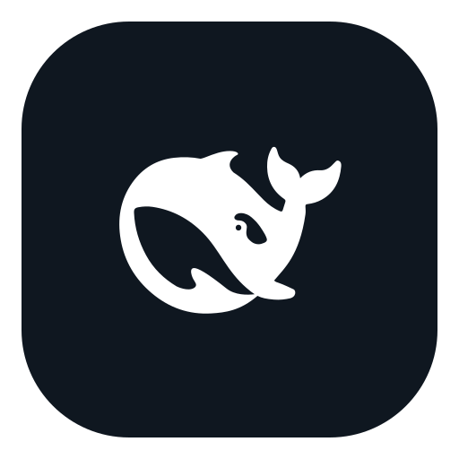

<h1 align="center">
  
  <br />
  DeepSeek Harness Desktop
</h1>

<p align="center">
  A minimal, local-first, cross-platform desktop shell for
  <a href="https://github.com/deepseek-ai/deepseek-harness">DeepSeek Harness</a>.
</p>

<p align="center">
  <a href="#简体中文">简体中文</a> · <a href="#english">English</a>
</p>

<p align="center">
  <a href="https://github.com/caomengxuan666/deepseek-harness-desktop/releases/latest"></a>
  <a href="LICENSE"></a>
  <a href="https://github.com/caomengxuan666/deepseek-harness-desktop/actions/workflows/release.yml"></a>
  
  
  
</p>


<a id="简体中文"></a>

## 简体中文

DeepSeek Harness Desktop 将官方 DeepSeek Harness Web 体验封装为独立桌面应用。无需手动启动 CLI 或管理端口，打开应用即可使用完整 Harness 界面。

本仓库是 [steven-kid/deepseek-harness-desktop](https://github.com/steven-kid/deepseek-harness-desktop) 的社区 Fork，由 [caomengxuan666/deepseek-harness-desktop](https://github.com/caomengxuan666/deepseek-harness-desktop) 维护。桌面宿主的核心实现、构建配置和上游许可均保留。

本项目只提供桌面宿主能力，不修改、不注入，也不重新实现 Harness UI。模型、会话、设置、插件和 Agent 能力均由官方 `@deepseek-ai/dsh` 提供。

> [!IMPORTANT]
> 本项目是非官方社区封装，目前仍属于早期版本，并依赖快速演进中的 `@deepseek-ai/dsh@0.1.0-rc.6`。macOS 构建尚未经过 Apple 公证，Windows 构建尚未进行商业代码签名。

### 下载

| 平台 | 架构 | 安装包 | 下载 |
| --- | --- | --- | --- |
| macOS | Apple Silicon | DMG | [下载 Apple Silicon 版本](https://github.com/caomengxuan666/deepseek-harness-desktop/releases/latest/download/DeepSeek-Harness-Desktop-0.3.1-arm64.dmg) |
| macOS | Intel | DMG | [下载 Intel 版本](https://github.com/caomengxuan666/deepseek-harness-desktop/releases/latest/download/DeepSeek-Harness-Desktop-0.3.1-x64.dmg) |
| Windows | x64 | 安装程序 | [下载 Windows 安装程序](https://github.com/caomengxuan666/deepseek-harness-desktop/releases/latest/download/DeepSeek-Harness-Desktop-0.3.1-windows-x64.exe) |
| Windows | x64 | 便携 ZIP | [下载 Windows ZIP](https://github.com/caomengxuan666/deepseek-harness-desktop/releases/latest/download/DeepSeek-Harness-Desktop-0.3.1-windows-x64.zip) |
| Linux | x64 | AppImage | [下载 AppImage](https://github.com/caomengxuan666/deepseek-harness-desktop/releases/latest/download/DeepSeek-Harness-Desktop-0.3.1-linux-x86_64.AppImage) |
| Debian / Ubuntu | x64 | deb | [下载 deb](https://github.com/caomengxuan666/deepseek-harness-desktop/releases/latest/download/DeepSeek-Harness-Desktop-0.3.1-linux-amd64.deb) |

全部当前和历史安装包可在 [GitHub Releases](https://github.com/caomengxuan666/deepseek-harness-desktop/releases) 查看。

### 为什么需要桌面版

DeepSeek Harness 已经提供完整的 Agent Runtime 和 Web UI。本项目不重复实现这些能力，而是补充桌面应用所需的宿主层：

- 自动启动和关闭本地 Harness 服务
- 自动分配随机 `127.0.0.1` 回环端口
- 等待 Harness 就绪后再显示应用窗口
- 提供单实例桌面窗口和外部链接安全处理
- 为渲染进程启用沙箱、`contextIsolation` 和导航限制
- 为 macOS、Windows 和 Linux 提供可直接安装的发行包

### 主要特性

- 直接进入官方 Harness 界面，无额外启动页
- 保留完整的设置、模型、会话、插件和 Agent 能力
- 应用退出时自动终止 Harness 子进程
- Web 服务仅监听随机本地回环端口，不暴露到局域网
- macOS 支持 Apple Silicon 和 Intel
- Windows 支持 x64 安装程序与便携 ZIP
- Linux 支持 x64 AppImage 和 deb
- Windows 使用官方应用内目录浏览器，避免打包环境下的原生文件夹对话框异常
- Windows 隐藏 Electron 默认的 File、Edit、View 和 Window 菜单栏

### 安装说明

#### macOS

macOS 构建已进行完整性签名，但尚未经过 Apple 公证。首次启动：

1. 打开 DMG，将 **DeepSeek Harness** 拖入“应用程序”。
2. 尝试打开应用；如果 macOS 阻止启动，请点击“完成”。
3. 打开“系统设置 → 隐私与安全性”。
4. 在“安全性”区域找到 DeepSeek Harness，点击“仍要打开”。
5. 再次点击“打开”确认。

该确认通常只需完成一次。

#### Windows

Windows 安装包尚未进行商业代码签名。如果 Microsoft Defender SmartScreen 出现提示：

1. 点击“更多信息”。
2. 点击“仍要运行”。
3. 按安装向导完成安装。

#### Linux

- AppImage：执行 `chmod +x DeepSeek-Harness-Desktop-*.AppImage` 后直接运行。
- Debian / Ubuntu：使用系统软件安装器打开 deb，或运行 `sudo apt install ./DeepSeek-Harness-Desktop-*.deb`。

### 安全模型

- Harness 服务仅绑定 `127.0.0.1`，每次启动使用随机端口
- Renderer 禁用 Node.js 集成
- 启用 `contextIsolation` 和 Chromium sandbox
- 新窗口和跨域导航交由系统浏览器处理
- Harness 在独立的 Electron Node 子进程中运行
- Cordis HMR 所需的 `--expose-internals` 只授予 Harness 子进程，不暴露给 Renderer

### 运行架构

```text
DeepSeek Harness Desktop
├── Electron Main
│   ├── 单实例窗口
│   ├── Harness 子进程生命周期
│   ├── 随机回环端口与就绪检测
│   └── 平台菜单和外部链接处理
│
├── Harness Child Process
│   └── @deepseek-ai/dsh web
│       └── http://127.0.0.1:<random-port>
│
└── Sandboxed BrowserWindow
    └── DeepSeek Harness Web UI
```

### 当前验证状态

| 平台 | 构建 | 打包后启动 | Web UI |
| --- | --- | --- | --- |
| macOS Apple Silicon | DMG / ZIP 通过 | 通过 | HTTP 200 |
| macOS Intel | DMG / ZIP 通过 | 通过 | HTTP 200 |
| Windows x64 | NSIS / ZIP 通过 | 通过 | HTTP 200 |
| Linux x64 | AppImage / deb 通过 | 通过 | HTTP 200 |

所有发行包都由匹配平台的 GitHub-hosted runner 构建，并在发布前执行打包后 smoke test。

### 已知限制

- 上游 DSH 仍是 RC 版本，接口和行为可能快速变化
- macOS 尚未接入 Developer ID 和 notarization
- Windows 尚未接入商业代码签名，首次启动可能出现 SmartScreen
- 尚未提供 Windows ARM64 和 Linux ARM64 构建
- 尚未集成自动更新

### 上游版本与许可

当前固定使用 `@deepseek-ai/dsh@0.1.0-rc.6`，以保证打包结果可复现。

桌面封装采用 [MIT License](LICENSE)。内置的 DeepSeek Harness 同样采用 MIT License，其许可声明保存在 [`third-party-licenses/deepseek-harness-LICENSE`](third-party-licenses/deepseek-harness-LICENSE)。

本项目与 DeepSeek 不存在隶属或官方合作关系。DeepSeek Harness 及相关名称的权利归其各自所有者所有。应用图标使用上游 DeepSeek Harness Web favicon 中的黑色鲸鱼图案。

---

<a id="english"></a>

## English

DeepSeek Harness Desktop packages the official DeepSeek Harness Web experience as a standalone desktop application. It removes the need to start the CLI manually or manage local ports while preserving the full Harness interface.

This repository is a community fork of [steven-kid/deepseek-harness-desktop](https://github.com/steven-kid/deepseek-harness-desktop), maintained at [caomengxuan666/deepseek-harness-desktop](https://github.com/caomengxuan666/deepseek-harness-desktop). The desktop host implementation, build configuration, and upstream license are preserved.

This project provides desktop hosting only. It does not modify, inject into, or reimplement the Harness UI. Models, sessions, settings, plugins, and agent capabilities remain provided by the official `@deepseek-ai/dsh` package.

> [!IMPORTANT]
> This is an unofficial community wrapper and an early-stage project. It depends on the rapidly evolving `@deepseek-ai/dsh@0.1.0-rc.6`. The macOS builds are not Apple-notarized, and the Windows builds are not commercially code-signed.

### Download

| Platform | Architecture | Package | Download |
| --- | --- | --- | --- |
| macOS | Apple Silicon | DMG | [Download for Apple Silicon](https://github.com/caomengxuan666/deepseek-harness-desktop/releases/latest/download/DeepSeek-Harness-Desktop-0.3.1-arm64.dmg) |
| macOS | Intel | DMG | [Download for Intel Mac](https://github.com/caomengxuan666/deepseek-harness-desktop/releases/latest/download/DeepSeek-Harness-Desktop-0.3.1-x64.dmg) |
| Windows | x64 | Setup installer | [Download Windows installer](https://github.com/caomengxuan666/deepseek-harness-desktop/releases/latest/download/DeepSeek-Harness-Desktop-0.3.1-windows-x64.exe) |
| Windows | x64 | Portable ZIP | [Download Windows ZIP](https://github.com/caomengxuan666/deepseek-harness-desktop/releases/latest/download/DeepSeek-Harness-Desktop-0.3.1-windows-x64.zip) |
| Linux | x64 | AppImage | [Download AppImage](https://github.com/caomengxuan666/deepseek-harness-desktop/releases/latest/download/DeepSeek-Harness-Desktop-0.3.1-linux-x86_64.AppImage) |
| Debian / Ubuntu | x64 | deb | [Download deb](https://github.com/caomengxuan666/deepseek-harness-desktop/releases/latest/download/DeepSeek-Harness-Desktop-0.3.1-linux-amd64.deb) |

All current and historical packages are available on the [GitHub Releases page](https://github.com/caomengxuan666/deepseek-harness-desktop/releases).

### Why this project exists

DeepSeek Harness already provides the complete agent runtime and Web UI. This project supplies the host capabilities required for a desktop product:

- Start and stop the local Harness service automatically
- Allocate a random `127.0.0.1` loopback port
- Wait for Harness readiness before displaying the window
- Provide a single-instance desktop window and safe external navigation
- Enable sandboxing, `contextIsolation`, and navigation restrictions
- Package installable releases for macOS, Windows, and Linux

### Features

- Opens directly into the official Harness interface
- Preserves the complete settings, models, sessions, plugins, and agent experience
- Gracefully terminates the Harness child process on application exit
- Listens only on a random local loopback port
- Supports macOS on Apple Silicon and Intel
- Provides a Windows x64 installer and portable ZIP
- Provides Linux x64 AppImage and deb packages
- Uses the official in-app directory browser on Windows to avoid packaged native-dialog worker failures
- Removes the default Electron File, Edit, View, and Window menu bar on Windows

### Installation

#### macOS

The macOS builds are integrity-signed but are not Apple-notarized. On first launch:

1. Open the DMG and drag **DeepSeek Harness** into **Applications**.
2. Try to open the app; if macOS blocks it, click **Done**.
3. Open **System Settings → Privacy & Security**.
4. Find DeepSeek Harness in the **Security** section and click **Open Anyway**.
5. Confirm by clicking **Open** once more.

This confirmation is normally required only once.

#### Windows

The Windows installer is not commercially code-signed. If Microsoft Defender SmartScreen appears:

1. Click **More info**.
2. Click **Run anyway**.
3. Complete the setup wizard.

#### Linux

- AppImage: run `chmod +x DeepSeek-Harness-Desktop-*.AppImage`, then launch it directly.
- Debian / Ubuntu: open the deb with the system software installer, or run `sudo apt install ./DeepSeek-Harness-Desktop-*.deb`.

### Security model

- Harness binds only to `127.0.0.1` on a random port
- Node.js integration is disabled in the renderer
- `contextIsolation` and the Chromium sandbox are enabled
- New windows and cross-origin navigation open in the system browser
- Harness runs in a separate Electron Node child process
- The `--expose-internals` permission required by Cordis HMR is granted only to the Harness child process

### Runtime architecture

```text
DeepSeek Harness Desktop
├── Electron Main
│   ├── Single-instance window
│   ├── Harness child-process lifecycle
│   ├── Random loopback port and readiness checks
│   └── Platform menu and external-link handling
│
├── Harness Child Process
│   └── @deepseek-ai/dsh web
│       └── http://127.0.0.1:<random-port>
│
└── Sandboxed BrowserWindow
    └── DeepSeek Harness Web UI
```

### Validation status

| Platform | Packaging | Packaged startup | Web UI |
| --- | --- | --- | --- |
| macOS Apple Silicon | DMG / ZIP passed | Passed | HTTP 200 |
| macOS Intel | DMG / ZIP passed | Passed | HTTP 200 |
| Windows x64 | NSIS / ZIP passed | Passed | HTTP 200 |
| Linux x64 | AppImage / deb passed | Passed | HTTP 200 |

Every release package is built on a matching GitHub-hosted runner and runs a packaged-app smoke test before publication.

### Known limitations

- Upstream DSH is still an RC release and may change rapidly
- Apple Developer ID signing and notarization are not integrated
- Commercial Windows code signing is not integrated, so SmartScreen may appear
- Windows ARM64 and Linux ARM64 packages are not currently provided
- Automatic updates are not integrated

### Upstream version and license

The project currently pins `@deepseek-ai/dsh@0.1.0-rc.6` for reproducible packaging.

The desktop wrapper is available under the [MIT License](LICENSE). The bundled DeepSeek Harness package is also MIT-licensed; its notice is preserved in [`third-party-licenses/deepseek-harness-LICENSE`](third-party-licenses/deepseek-harness-LICENSE).

This project is not affiliated with or endorsed by DeepSeek. DeepSeek Harness and related names belong to their respective owners. The application icon uses the black whale artwork from the upstream DeepSeek Harness Web favicon.
